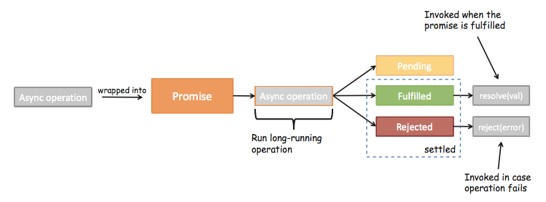
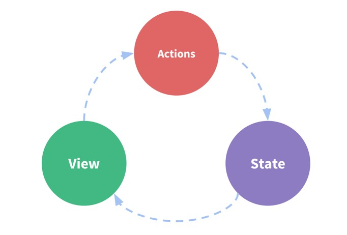
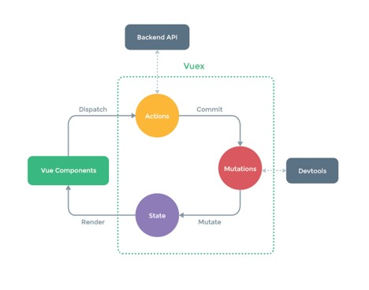
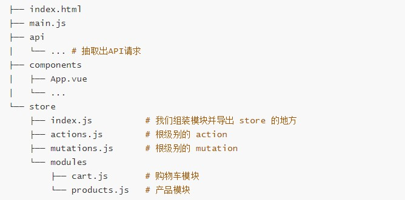

# Promise
## 一、Promise的介绍
+ Promise是异步编程的一种解决方案

```vue
<script>
  //  参数 -> 函数(resolve, reject)
  //  resolve, reject本身它们又是函数
  //  链式编程
  new Promise((resolve, reject) => {
    setTimeout(() => {
      resolve()
    },1000)
  }).then(() => {
    console.log('Hello World');
    
    return new Promise((resolve, reject) => {
      setTimeout(() => {
        resolve()
      },1000)
    }).then(() => {
      console.log('Hello Vuejs');
      
      setTimeout(() => {
        console.log('Hello Python');
      },1000)
    })
  })
  //  什么情况下会用到Promise？一般情况下是有异步操作时，使用Promise对这个异步操作进行封装
  //  new -> 构造函数（1.保存一些状态信息 2.执行传入的函数）
  //  在执行传入的回调函数时，会传入两个参数，resolve，reject，本身又是函数
  new Promise((resolve,reject) => {
    setTimeout() => {
      //  成功的时候调用resolve
      resolve('Hello World')
      
      //  失败的时候调用reject
      reject(error message'')
    },1000)
  }).then((data) => {
    console.log(data);
  }).catch(err => {
    console.log(error);
  })
</script>
```
## 二、Promise的三种状态


+ 当我们开发中有异步操作时, 就可以给异步操作包装一个Promise

+ 异步操作之后会有三种状态：

  ①pending：等待状态，比如正在进行网络请求，或者定时器没有到时间

  ②fulfill：满足状态，当我们主动回调了resolve时，就处于该状态，并且会回调.then()

  ③reject：拒绝状态，当我们主动回调了reject时，就处于该状态，并且会回调.catch()

```js
//另外处理方式
new Promosie((resolve, reject) => {
  setTimeout(() => {
    //  resolve('Hello Vuejs')
    reject('error message')
  },1000)
}).then(data => {
  console.log(data)
}, err => {
  console.log(err);
})
```

## 三、Promise链式调用
```js
new Promise((resolve, reject) => {
  setTimeout(() => {
    resolve('aaa')
  },1000)
}).then(data => {
  console.log(data);
  
  return new Promise((resolve) => {
    resolve(data+'111')
  })
}).then(data => {
  console.log(data);
  
  return new Promise((resolve) => {
    resolve(data+'222')
  })
}).then(data => {
  console.log(data);
})
```
+ `Promise.resovle()`：将数据包装成Promise对象，并且在内部回调resolve()函数

+ `Promise.reject()`：将数据包装成Promise对象，并且在内部回调reject()函数

```
new Promise((resolve, reject) => {
  setTimeout(() => {
    resolve('aaa')
  },1000)
}).then(data => {
  console.log(data);
  
  return Promise.resolve('data'+'111')
}).then(data => {
  console.log(data);
  
  return Promise.resolve('data'+'222')
}).then(data => {
  console.log(data);
})
```
### 省略Promise.resolve
```
new Promise((resolve, reject) => {
  setTimeout(() => {
    resolve('aaa')
  },1000)
}).then(data => {
  console.log(data);
  
  return 'data'+'111'
}).then(data => {
  console.log(data);
  
  return 'data'+'222'
}).then(data => {
  console.log(data);
})
```
```
new Promise((resolve, reject) => {
  setTimeout(() => {
    resolve('aaa')
  },1000)
}).then(data => {
  console.log(data);
  
  //return Promise.reject('error message');
  throw 'error message'
}).then(data => {
  console.log(data);
  
  return 'data'+'222'
}).then(data => {
  console.log(data);
}).catch(err => {
  console.log(err);
})
```
## Promise的all方法使用
```
Promise.all([
  new Promise((resolve, reject) => {
   setTimeout(() => {
    resolve('result1');
   }, 2000)
  }),
  new Promise((resolve, reject) => {
   setTimeout(() => {
    resolve('result2');
   }, 1000) 
  })
]).then(results => {
  console.log(results);
})
```

# Vuex
## 一、认识Vuex
+ Vuex 是一个专为 Vue.js 应用程序开发的状态管理模式，用于在多个组件间共享状态
+ 专门在Vue中实现集中式状态（数据）管理的一个Vue插件，对vue应用中多个组件的共享状态进行集中式的管理（读/写），也是一种组件间通信的方式，且适用于任意组件间通信

### 单界面的状态管理


State：状态，姑且可以当做是data中的属性

View：视图层，可以针对State的变化，显示不同的信息

Actions：这里主要是用户的各种操作：点击、输入等等，会导致状态的改变

### 多界面的状态管理


## 二、Vuex的基本使用
1.提取出一个公共的store对象，用于保存在多个组件中共享的状态

2.将store对象放置在new Vue对象中，这样可以保证在所有的组件中都可以使用到

3.在其他组件中使用store对象中保存的状态即可

·通过`this.$store.state.`属性的方式来访问状态

·通过`this.$store.commit('mutation中方法')`来修改状态

```src/store/index.js
import Vue from 'vue'
import Vuex from 'vuex'

//  1.安装插件
Vue.use(Vuex)

//  2.创建对象
const store = new Vuex.Store({
  state: {
    counter: 0
  },
  mutations: {
    // 方法
    increment(state) {
      state.counter++
    }
  },
  actions: {
  },
  getters: {
  },
  modules: {
  }
})
 
//  3.导出store对象
export default store

```


```
<template>
  <div>
    <h2>{{ $store.state.counter }}</h2>
    <button @click='addition'>+</button>
  </div>
</template>

<script>
  export default {
    methods: {
      addition() {
        this.$store.commit('increment')
      }
    }
  }
</script>
```
## 三、Vuex核心概念
### State
#### State单一状态树
如果你的状态信息是保存到多个Store对象中的，那么之后的管理和维护等等都会变得特别困难

所以Vuex也使用了单一状态树来管理应用层级的全部状态

单一状态树能够让我们最直接的方式找到某个状态的片段，而且在之后的维护和调试过程中，也可以非常方便地管理和维护

### Getters
类似计算属性

getters默认是不能传递参数的, 如果希望传递参数, 那么只能让getters本身返回另一个函数

```
const store = new Vuex.Store({
  state: {
    counter: 1000,
    students: [
      {name: 'why', age: 18},
      {name: 'kobe', age: 24},
      {name: 'james', age: 30},
      {name: 'curry', age: 10}
    ]
  },
  getters: {
    powerCounter(state) {
      return state.counter * state.counter
    },
    more20stu(state) {
      return state.students.filter(s => s.age > 20)
    },
    more20stuLength(state, getters) {
      return getters.more20stu.length
    },
    moreAgeStu(state) {
      return function(age) {
        return state.students.filter(s => s.age > age)
      }
    }
  }
})
```
```
<template>
  <div>
    <h2>{{ $store.getters.powerCounter }}</h2>
    // <h2>{{ more20stu }}</h2>
    <h2>{{ $store.getters.more20stu }}</h2>
    <h2>{{ $store.getters.more20stu.length }}</h2>
    <h2>{{ $store.getters.more20stuLength }}</h2>
    <h2>{{ $store.getters.moreAgeStu(12) }}</h2>
  </div>
</template>
```
```
<script>
  export default {
    computed: {
     // more20stu() {
     //   return this.$store.state.students.filter(s => s.age > 20)
     // }
    }
  }
</script>
```
### Mutation
Vuex的store状态的更新唯一方式：提交Mutation

Mutation主要包括两部分：

&ensp; 字符串的事件类型（type）

&ensp; 一个回调函数（handler），该回调函数的第一个参数就是state

在通过mutation更新数据的时候, 有可能我们希望携带一些额外的参数：参数被称为是mutation的载荷(Payload)

当有很多参数需要传递时，通常以对象的形式传递, 也就是payload是一个对象


```
mutations: {
  incrementCount(state, count) {
    state.counter += count
  }
}
```
```
methods: {
  addCount(count) {
    this.$store.commit('incrementCount', count)
  }
}
```
#### Mutation的提交风格
通过commit进行提交是一种普通的方式

Vue还提供了另外一种风格, 它是一个包含type属性的对象

Mutation中的处理方式是将整个commit的对象作为payload使用
```
mutations: {
  incrementCount(state, payload) {
    state.counter += payload.count
  }
}
```
```
methods: {
  addCount(count) {
    this.$store.commit({
      type: 'incrementCount',
      count
    })
  }
}
```
#### Mutation的响应规则
Vuex的store中的state是响应式的, 当state中的数据发生改变时, Vue组件会自动更新

这就要求我们必须遵守一些Vuex对应的规则：

（1）提前在store中**初始化**好所需的属性

（2）当给state中的对象添加新属性时, 使用下面的方式：

&ensp; &ensp; ①使用Vue.set(obj, 'newProp', 123)

&ensp; &ensp; ②用新对象给旧对象重新赋值
```
state: {
  info: {
    name: 'kobe',
    age: 40,
    height: 1.98
  }
},
mutations: {
  updateInfo(state) {
    //非响应式 state.info['address'] = '洛杉矶'
    Vue.set(state.info, 'address', '洛杉矶')
    //非响应式 delete state.info.age
    Vue.delete(state.info, 'age')
  }
}
```
#### Mutation的类型常量
在各种Flux实现中, 一种很常见的方案就是使用常量替代Mutation事件的类型

我们可以将这些常量放在一个单独的文件中, 方便管理以及让整个app所有的事件类型一目了然

我们可以创建一个文件: mutation-types.js, 并且在其中定义我们的常量

定义常量时, 我们可以使用ES2015中的风格, 使用一个常量来作为函数的名称
```
export INCREMENT = 'increment'
```
```
mutations: {
  [INCREMENT](state) {
    state.counter++
  }
}
```
```
methods: {
  addition() {
    this.$store.commit(INCREMENT)
  }
}
```
#### Mutation的同步函数
通常情况下, Vuex要求我们Mutation中的方法必须是**同步方法**

主要的原因是当我们使用devtools时, devtools可以帮助我们捕捉mutation的快照

但是如果是异步操作, 那么devtools将不能很好地追踪这个操作什么时候会被完成

### Action
Action类似于Mutation, 但是是用来代替Mutation进行**异步操作**的
```
actions: {
  aUpdateInfo(context, payload) {
    return new Promise((resolve, reject) => {
      setTimeout(() => {
        context.commit('updateInfo');
        console.log(payload);
        resolve('111')
      }, 1000)
    })
  }
}
```
在Vue组件中, 如果我们调用action中的方法, 那么就需要使用dispatch

同样的, 也是支持传递payload

```
methods: {
  updateInfo() {
    this.$store
    .dispatch('aUpdateInfo', '我是payload')
    .then(res => {
      console.log('里面完成了提交');
      console.log(res)
    })
  }
}
```
### Module
Vue使用单一状态树,那么也意味着很多状态都会交给Vuex来管理;当应用变得非常复杂时,store对象就有可能变得相当臃肿

为了解决这个问题, Vuex允许我们将store分割成模块(Module), 而每个模块拥有自己的state、mutations、actions、getters等

```
const moduleA = {
  state: {
    name: 'zhangsan'
  },
  mutations: {
    updateName(state, payload) {
      state.name = payload
    }
  },
  getters: {
    fullname(state) {
      return state.name + '111'
    },
    fullname2(state, getters) {
      return getters.fullname + '222'
    },
    fullname3(state, getters, rootState) {
      return getters.fullname2 + rootState.counter
    }
  }
}

const store = new Vuex.Store({
  modules: {
    a: moduleA
  }
})
```
```
$store.state.a.name

this.$store.commit('updateName', 'lisi')

$store.getters.fullname
```

## 四、Vuex的项目结构



# 网络模块封装
## 一、axios的基本使用
```js
import axios from 'axios'

axios({
  url: 'http://123.207.32.32:8000/home/multidata',
  method: 'get'
}).then(res => {
  console.log(res);
})

axios({
  url: 'http://123.207.32.32:8000/home/data',
  // 专门针对get请求的参数拼接
  params: {
    type: 'pop',
    page: 1
  }
}).then(res => {
  console.log(res);
})
```
## 二、axios发送并发请求
`axios.all`，可以放入多个请求的数组

`axios.all([])` 返回的结果是一个数组，使用 `axios.spread` 可将数组 [res1,res2] 展开为 res1, res2

```js
axios.all([axios(), axios()])
  .then(results => {
  })
```
```js
axios.all([axios(), axios()])
  .then(axios.spread((res1, res2) => {
    console.log(res1),
    console.log(res2)
  })
```
## 三、axios的配置
在开发中可能很多参数都是固定的

这个时候我们可以进行一些抽取, 也可以利用axiox的**全局配置**：

```js
axios.defaults.baseURL = 'http://123.207.32.32:8000'
axios.defaults.timeout = 5000
```
## 四、axios的实例和模块封装
某些请求需要使用特定的baseURL或者timeout或者content-Type等

这个时候, 我们就可以创建新的实例, 并且传入属于该实例的配置信息

### 创建axios实例
```js
const instance1 = axios.create({
  baseURL: '',
  timeout: 
})

instance1({
  url: '/home/multidata'
}).then(res => {
  console.log(res);
})

instance1({
  url: '/home/data',
  params: {
    type: 'pop',
    page: 1
  }
}).then(res => {
  console.log(res);
})
```
### axios封装
方式一
```js
import axios from 'axios'

export function request(config, success, failure) {
  const instance = axios.create({
    baseURL: '',
    timeout: 
  })
  
  instance(config)
    .then(res => {
      success(res);
    })
    .catch(err => {
      failure(err)
    })
}
```
```js
import {request} from './network/request'

request({
  url: '/home/multidata'
}, res => {
  console.log(res);
}, err => {
  console.log(err);
})
```
方式二
```js
import axios from 'axios'

export function request(config) {
  const instance = axios.create({
    baseURL: '',
    timeout: 
  })
  
  instance(config.baseConfig)
    .then(res => {
      config.success(res);
    })
    .catch(err => {
      config.failure(err)
    })
}
```
```js
import {request} from './network/request'

request({
  baseConfig: {
  },
  success: function(res) {
  },
  failure: function(err) {
  }
})
```
**方式三**
```js
export function request(config) {
  return new Promise((resolve, reject) => {
    const instance = axios.create({
      baseURL: '',
      timeout: 
    })

    instance(config)
      .then(res => {
        resovle(res)
      })
      .catch(err => {
        reject(err)
      })  
  })
}
```
```js
import {request} from './network/request'

request({
  url: ''
}).then(res => {
  console.log(res);
}).catch(err => {
  console.log(err);
})
```
**方法四**
```js
export function request(config) {
  const instance = axios.create({
    baseURL: '',
    timeout: 
  })
  
  return instance(config)
}
```
### 五、axios的拦截器
axios提供了拦截器，用于我们在发送每次请求或者得到相应后，进行对应的处理

`instance.interceptors.request`：拦截请求

`instance.interceptors.response`：拦截响应
```
export function request(config) {
  // 1.创建axios的实例
  const instance = axios.create({
    baseURL: '',
    timeout: 
  })
  
  // 2.axios的拦截器
  // 2.1.请求拦截
  instance.interceptors.request.use(config => {
    console.log(config);
    // 1.比如config中的一些信息不符合服务器的要求
    // 2.比如每次发送网络请求时，都希望在界面中显示一个请求的图标
    // 3.某些网络请求（比如登录（token）），必须携带一些特殊的信息
    return config
  }, err => {
    console.log(config);
  })
  
  // 2.2.响应拦截
  instance.interceptors.response.use(res => {
    console.log(res);
    return res.data;
  }, err => {
    console.log(err);
  })
  
  // 3.发送真正的网络请求
  return instance(config)
}
```

