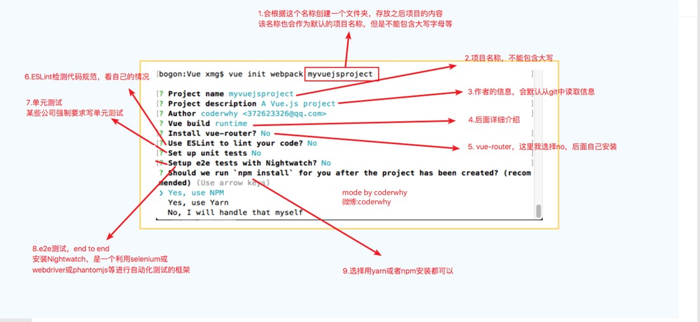
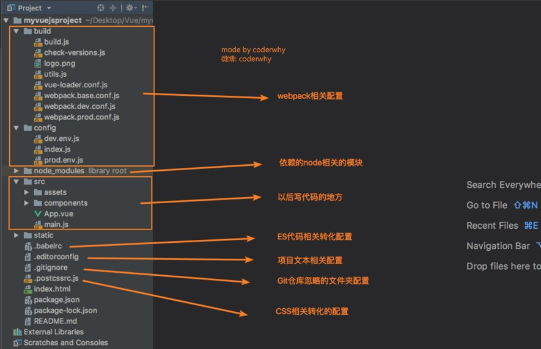
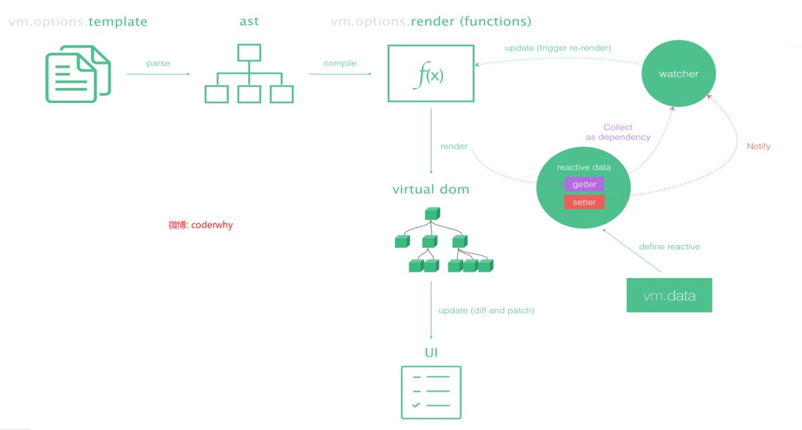
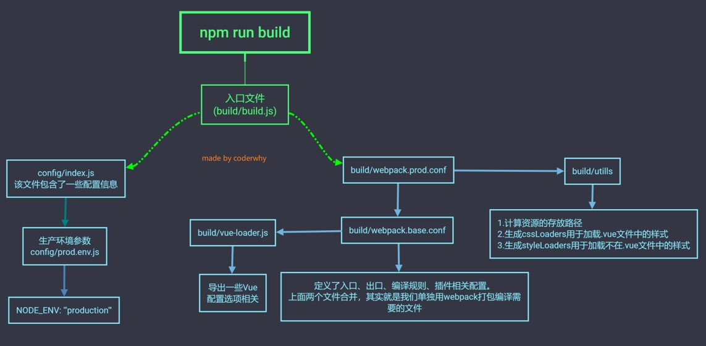
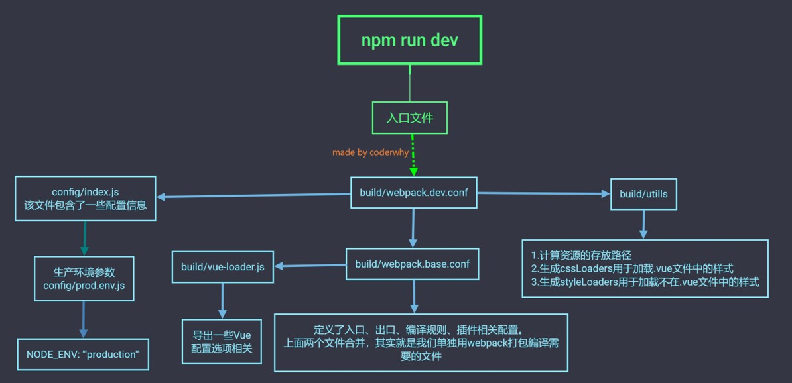
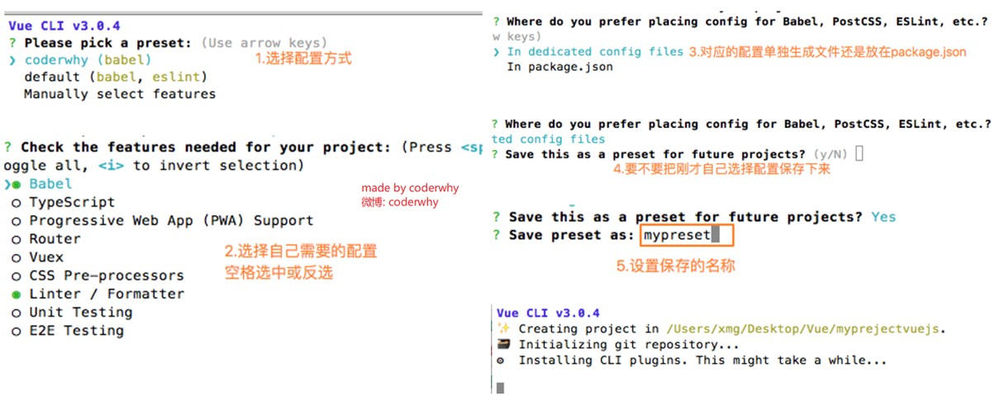
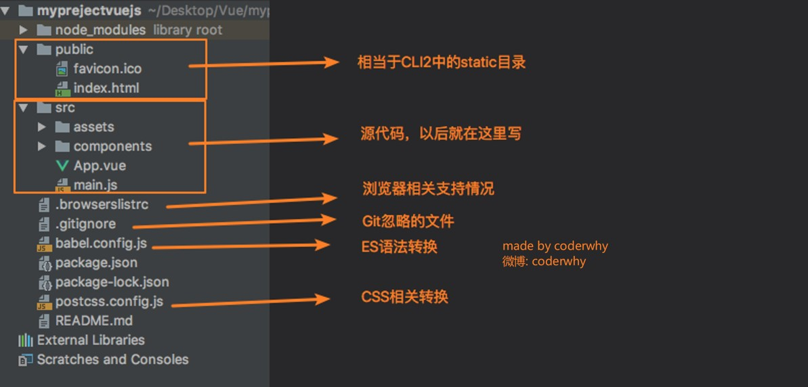

# VueCLI
使用Vue.js开发大型应用时，我们需要考虑代码目录结构、项目结构和部署、热加载、代码单元测试等事情

CLI是Command-Line Interface, 翻译为命令行界面, 俗称脚手架

[Vue CLI](https://cli.vuejs.org/zh/)是一个官方发布的 vue.js 项目脚手架

使用 vue-cli 可以快速搭建Vue开发环境以及对应的webpack配置

## 一、vue-cli的安装
Vue CLI使用前提 - Node

Vue CLI使用前提 - Webpack

安装Vue脚手架：`npm install -g @vue/cli`

*上面安装的是Vue CLI3的版本，如果需要按照Vue CLI2的方式初始化项目时是不可以的

拉取2.x模板（旧版本）：`npm install -g @vue/cli-init`

**Vue CLI2初始化项目：`vue init webpack 项目名称`**


**Vue CLI3初始化项目：`vue create 项目名称`**

## 二、vue-cli2
### 目录结构



安装CLI错误：删除`C:\Users\Administrator\AppData\Roaming\npm-cache`

`./config/index.js`中`useEslint`可以开关Eslint
### runtime+compiler和runtime-only区别
Vue程序运行过程



`runtime+compiler`:template -> ast -> render -> vdom -> UI

`runtime-only`：render -> vdom -> UI
*由vue-template-compiler处理.vue文件中的template

·性能更高

·代码量更少

**render函数**
```main.js
new Vue({
  el: '#app',
  render: function(createElement) {
    //1.普通用法：createElenment('标签',{标签的属性(可以不传)},['内容数组'])
    return createElenment('h2',
      {class: 'box'},
      ['Hello World', createElenment('button',['按钮'])])
  }
})
```
```
new Vue({
  el: '#app',
  render: function(createElement) {
    //1.传入组件对象：
    return createElenment(App)
  }
})
```
如果在之后的开发中，你依然使用template，就需要选择Runtime-Compiler

如果在之后的开发中，使用的是.vue文件夹开发，那么可以选择Runtime-only

**npm run build**


**npm run dev**


## 三、vue-cli3
·vue-cli 3 是基于 webpack 4 打造，vue-cli 2 还是 webapck 3

·vue-cli 3 的设计原则是“0配置”，移除的配置文件根目录下的build和config等目录

·vue-cli 3 提供了 vue ui 命令，提供了可视化配置，更加人性化

·移除了static文件夹，新增了public文件夹，并且index.html移动到public中



### 目录结构


自定义配置

添加`./src/vue.config.js`：
```
module.exports = {

}
```
*箭头函数中this的使用：
向外层作用域中，一层层查找this，直到有this的定义
```
const obj = {
  aaa() {
    setTimeout(function() {
      setTimeout(function() {
        console.log(this);  //window
      })
      
      setTimeout(() => {
        console.log(this);  //window
      })
    })
    
    setTimeout(() => {
      setTimeout(function() {
        console.log(this);  //window
      })
      
      setTimeout(() => {
        console.log(this);  //obj
      })
    })
  }
}
```
# Vue-router
## 一、认识路由
路由就是通过互联的网络把信息从源地址传输到目的地址的活动

路由器提供了两种机制: 路由和转送

**路由**是决定数据包从来源到目的地的路径

**转送**将输入端的数据转移到合适的输出端

路由中有一个非常重要的概念叫路由表：路由表本质上就是一个**映射表**, 决定了数据包的指向
### 后端路由阶段

**后端渲染**：早期的网站开发整个HTML页面是由服务器来渲染的；服务器直接生产渲染好对应的HTML页面, 返回给客户端进行展示

**后端路由**：后端处理URL和页面之间的映射关系

一个页面有自己对应的网址, 也就是URL；

URL会发送到服务器, 服务器会通过正则对该URL进行匹配, 并且最后交给一个Controller进行处理；

Controller进行各种处理, 最终生成HTML或者数据, 返回给前端；

这就完成了一个IO操作

*当我们页面中需要请求不同的路径内容时, 交给服务器来进行处理, 服务器渲染好整个页面, 并且将页面返回给客户端

*这种情况下渲染好的页面, 不需要单独加载任何的js和css, 可以直接交给浏览器展示, 这样也有利于SEO的优化

#### 后端路由的缺点:

·整个页面的模块由后端人员来编写和维护的

·前端开发人员如果要开发页面, 需要通过PHP和Java等语言来编写页面代码

·通常情况下HTML代码和数据以及对应的逻辑会混在一起, 编写和维护都是非常糟糕的事情

### 前后端分离阶段
**前后端分离**：后端只负责提供数据，不负责任何界面的内容

随着Ajax的出现, 有了前后端分离的开发模式

后端只提供API来返回数据, 前端通过Ajax获取数据, 并且可以通过JavaScript将数据渲染到页面中

**优点：**

·前后端责任清晰, 后端专注于数据上, 前端专注于交互和可视化上；

·并且当移动端(iOS/Android)出现后, 后端不需要进行任何处理, 依然使用之前的一套API即可

**前端渲染**：浏览器中显示的网页中的大部分内容，都是由前端写的js代码在浏览器中执行，最终渲染出来的网页

### 单页面富应用阶段
其实SPA最主要的特点就是在前后端分离的基础上加了一层前端路由，也就是前端来维护一套路由规则

SPA：单页面富应用。整个网页只有一个html页面

**前端路由**的核心：改变URL，但是页面不进行整体的刷新

## 二、前端路由
### URL的hash
URL的hash也就是锚点（#），本质上是改变window.location的href属性

可以通过直接赋值location.hash来改变href，但是页面不发生刷新

在控制台输入`location.hash = 'aaa'`

### HTML5的history模式

#### pushState
在控制台输入`history.pushState({},'','home')`

*类似栈，可以返回

#### replaceState
在控制台输入`history.replaceState({},'','home')`

*不能返回

#### go
在控制台输入
```
history.pushState({},'','home')
history.pushState({},'','about')
history.pushState({},'','me')
history.pushState({},'','test')
history.go(-1)
```
*`history.go(-1)`等价于`history.back()`

*`history.go(1)`等价于`history.forward()`

*这三个接口等同于浏览器界面的前进后退

## 三、Vue-router
[vue-router](https://router.vuejs.org/zh/)是Vue.js官方的路由插件，它和vue.js是深度集成的，适合用于构建单页面应用vue-router是基于路由和组件的

路由用于设定访问路径, 将路径和组件映射起来

在vue-router的单页面应用中, 页面的路径的改变就是组件的切换

### vue-router的安装和配置
安装vue-router：`npm install vue-router --save`

在模块化工程中使用它（因为是一个插件, 所以可以通过Vue.use()来安装路由功能）：

①导入路由对象，并且调用Vue.use(VueRouter)

②创建路由实例，并且传入路由映射配置

③在Vue实例中挂载创建的路由实例

```src/router/index.js
//配置路由相关的信息
import VueRouter from 'vue-router'
import Vue from 'vue'

//1.通过Vue.use(插件)，安装插件
Vue.use(VueRouter)

//2.创建VueRouter对象
const routes = [
  
]

const router = new VueRouter({
  // 配置路由和组件之间的应用关系
  routes
})

//3.将router对象传入到vue实例
export default router
```
```main.js
import router from './router'

new Vue({
  el: '#app',
  router,
  render: h => h(App)
})
```

### vue-router的使用
①创建路由组件

②配置路由映射: 组件和路径映射关系
```router/index.js
import Home from '../components/Home'
import About from '../components/About'

const router = [
  {
    path: '/home',
    component: Home
  },
  {
    path: '/about',
    component: About
  }
]
```
③使用路由: 通过<router-link>和<router-view>
```App.vue
<template>
  <div id='app'>
    <router-link to='/home'>首页</router-link>
    <router-link to='/about'>关于</router-link>
    <router-view></router-view>
  </div>
</template>
```
`<router-link>`: 该标签是一个vue-router中已经内置的组件, 它会被渲染成一个<a>标签
  
`<router-view>`: 该标签会根据当前的路径, 动态渲染出不同的组件 *相当于一个占位的东西
  
网页的其他内容, 比如顶部的标题/导航, 或者底部的一些版权信息等会和<router-view>处于同一个等级

在路由切换时, 切换的是<router-view>挂载的组件, 其他内容不会发生改变

### 路由的默认值
让路径默认跳到到首页, 并且<router-view>渲染首页组件
```
const routes = [
  {
    path: '',
    //重定向
    redirect: '/home'
  },  
  ...
]
```
*改变路径的方式有两种：URL的hash和HTML5的history
  
*默认情况下, 路径的改变使用的URL的hash => localhost:8081/#/home

*如果希望使用HTML5的history模式，配置:
```index.js
const router = new VueRouter({
  routes,
  mode: 'history'
})
```
### router-link的属性补充
`tag`: tag可以指定<router-link>之后渲染成什么组件, 而不是默认的<a>标签
```
<router-link tag='button'></router-link>
```
`replace`: replace不会留下history记录, 所以指定replace的情况下, 不能返回到上一个页面中
```
<router-link replace></router-link>
```
`active-class`: 当<router-link>对应的路由匹配成功时, 会自动给当前元素设置一个router-link-active的class, 设置active-class可以修改默认的名称
```
<router-link active-class='active'></router-link>
```
批量改
```index.js
const router = new VueRouter({
  linkActiveClass: 'active'  
})
```
### 通过代码跳转路由
`this.$router.push('/home')`
  
*可以返回
  
`this.$router.replace('/home')`
  
*不能返回

#### 动态路由
```
import User from '../components/User'
const routes = [
  {
    path: '/user/:userId',
    component: User
  }  
]
```
```
  <router-link to='/user/zhangsan'></router-link>
``` 
```App.vue
  <router-link :to="'/user/'+userId"></router-link>

export default {
  name: 'App'
  data() {
    return{
      userId: 'lisi'
    }
  }
}
```
```User.vue
  <h2>{{ userId }}</h2>
  <h2>{{ $route.params.userId }}</h2>
  
  export default {
    name: 'User',
    computed: {
      userId() {
        return this.$route.params.userId
      }
    }
  }
```
### 路由的懒加载
路由懒加载的主要作用就是将路由对应的组件打包成一个个的js代码块
  
只有在这个路由被访问到的时候, 才加载对应的组件


*app： 当前应用程序开发的所有代码（业务代码）
  
*manifest：为打包的代码做底层支撑

*vendor：提供商，第三方/vue/vue-router/axios/bs

#### 路由懒加载的方式
①结合Vue的异步组件和Webpack的代码分析
```
const Home = resolve => { require.ensure(['../components/Home.vue'], () => { resolve(require('../components/Home.vue')) })};
```
②AMD写法
```
const About = resolve => require(['../components/About.vue'], resolve);
```
③在ES6中, 我们可以有更加简单的写法来组织Vue异步组件和Webpack的代码分割
```
const Home = () => import('../components/Home.vue')
```
### 嵌套路由
####嵌套路由的步骤
①创建对应的子组件, 并且在路由映射中配置对应的子路由
```
  {
    path: '/home',
    component: Home,
    children: [
      {
        path: '',
        redirect: 'news'
      },
      {
        path: 'news',
        component: Homenews
      },
      {
        path: 'message',
        component: HomeMessage
      }
    ]
  }
```  
②在组件内部使用<router-view>标签
```Home.vue
  <router-link to='/home/news'></router-link>
  <router-link to='/home/message'></router-link>
  <router-view></router-view>
```

### 传递参数
传递参数主要有两种类型: params和query
  
#### ①params
配置路由格式： `/router/:id`
  
传递的方式：在path后面跟上对应的值
  
传递后形成的路径：/router/123
  
#### ②query
  
配置路由格式：`/router`，也就是普通配置
  
传递的方式：对象中使用query的key作为传递方式
  
传递后形成的路径：/router?id=123
```App.vue
  <router-link :to='{path: '/profile', query: {name: 'why', age: 18, height: 1.88}}'></router-link>
  
  this.$router.push('/user/' + this.userId)
  this.$router.push({
    path: '/profile',
    query: {
      name: 'kobe',
      age: 19,
      height: 1.87
    }
  })
  
```  
获取参数通过`$route`对象获取
  
```Profile.Vue
  <h2>{{ $route.query.name }}</h2>
```
  
### $route和$router的区别
$router为VueRouter实例，想要导航到不同URL，则使用$router.push方法
  
$route为当前router跳转对象，里面可以获取name、path、query、params等 

*所有的组件都继承自Vue类的原型

### 导航守卫
vue-router提供的**导航守卫**主要用来监听路由的进入和离开
  
vue-router提供了`beforeEach`和`afterEach`的钩子函数, 它们会在路由即将改变前和改变后触发

#### 生命周期函数

`created()`：组件创建出来时回调
```
created() {
  document.title = '用户'  
}  
```  
`mounted()`：组件挂载到DOM上时回调
  
`updated()`：界面更新时回调

`destroy()`：组件销毁时回调
  
#### 全局导航守卫
##### 前置守卫(guard)
```
const routes = [
  {
    path: '/home',
    component: Home,
    meta: {
      title: '首页'
    }
  }  
]
  
router.beforeEach((to, from, next) => {
  console.log(to)
  document.title = to.matched[0].meta.title
  next()  
})
```  
to：即将要进入的目标的路由对象
  
from：当前导航即将要离开的路由对象
  
next：必须调用该方法后, 才能进入下一个钩子

##### 后置钩子(hook)
```
router.afterEach((to, from) => {  
})
```  
#### [其他守卫](https://router.vuejs.org/zh/guide/advanced/navigation-guards.html#%E8%B7%AF%E7%94%B1%E7%8B%AC%E4%BA%AB%E7%9A%84%E5%AE%88%E5%8D%AB)
路由独享的守卫
  
组件内的守卫

### keep-alive
`keep-alive` 是 Vue 内置的一个组件，可以使被包含的组件保留状态，或避免重新渲染（避免组件被频繁创建、销毁）
```
  <keep-alive>
    <router-view/>
  </keep-alive>
```  
```
  activated(){
    this.$router.push(this.path);
  }
  beforeRouteLeave(to, from, next) {
    this.path = this.$route.path;
    next()
  }
```
`activated()`和`deactivated()`：只有该组件被使用了keep-alive时，才是有效的
#### keep-alive的属性
`include`：字符串或正则表达，只有匹配的组件会被缓存
  
`exclude`：字符串或正则表达式，任何匹配的组件都不会被缓存
```
  <keep-alive exclude='Profile,User'> <!--逗号后面不能加空格-->
    <router-view/>
  </keep-alive>
```  
### 路径别名
+ **vue-cli2**的`webpack.base.conf.js`中：
```
  resolve: {
    extensions: ['.js','.vue','.json'],
    alias: {
      '@': resolve('src'),
      'assets': resolve('@/assets'),
      'components': resolve('@/components'),
      'views': resolve('@/views')
    }
  }
  
```
+ 在**vue-cli3**中新建`vue.config.js`：
```
module.exports = {
    configureWebpack: {
        resolve: {
            alias: {
                'assets': '@/assets',
                'common': '@/common',
                'components': '@/components',
                'network': '@/network',
                'views': '@/views',
            }
        }
    }
}
```
+ 在**html**中使用时
```
  
```  
# [Promise](Promise.md)
